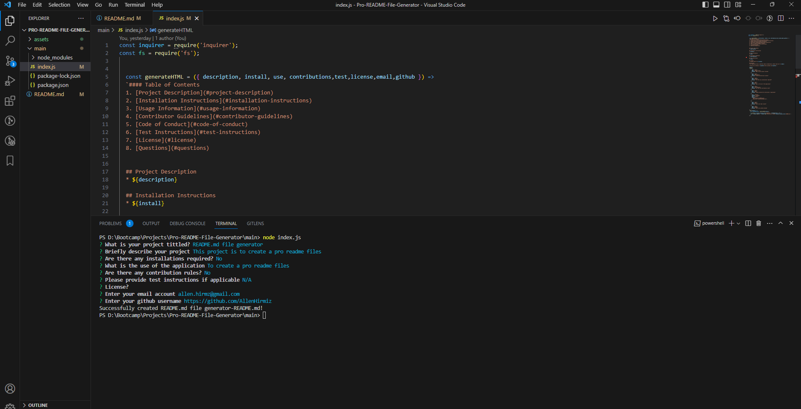

# Pro README File Generator

## Pro README File Generator
This repository was created to allow the users to create a professional README.md file based on their answers to a set of questions that are created specifically to create the README.md file.

This project contain a few pages but the main page to run the README.md generator is located at index.js, this function is possible via nodeJS to allow the project to create files and in this project is to create README.md file based on set of questions.

This project is mainly focused on showing up my skills in JS with the integration of NodeJS libraries and improve on it as I progress my journey of learning full stack. 

The README.md file name will be created based on the project tile + "-README.md" as an example Weather-App-API-README.md.
## GitHub Repo URL
https://github.com/AllenHirmiz/Pro-README-File-Generator

## Website URL
https://allenhirmiz.github.io/Pro-README-File-Generator/main/

## Table of Contents
This project gets run via command line only and it doesn't have a page to run and display the questions needed to create the README.md file.

## Installation
Command Line
## Technologies Used
Pro README File Generator project is built using the following technologies:

JavaScript: Dynamic and interactive elements, such as animations and form validation.
NodeJS:
inquirer Library: 

## Mock-Up

The following image shows the web application's appearance and functionality:

## Command line Screenshot
Screenshot of the command line that is needed to create README.md file. 

## Command line file example video
Click on the screenshot to direct you the youtube video of a demo for this project.
